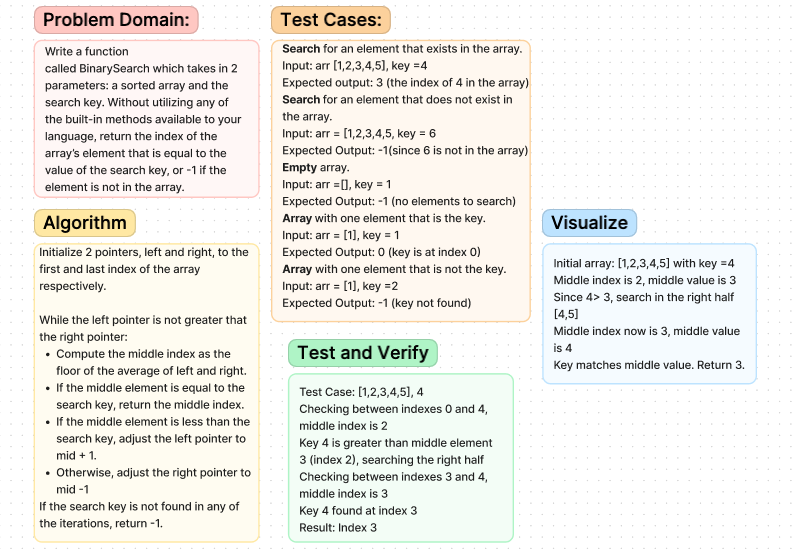

# Binary Search
Write a function called BinarySearch which takes in 2 parameters: a sorted array and the search key. Without utilizing any of the built-in methods available to your language, return the index of the array’s element that is equal to the value of the search key, or -1 if the element is not in the array.

## Whiteboard Process

## Approach & Efficiency
Binary search is an efficient algorithm for finding an item from a sorted list of items. It works by repeatedly dividing in half the portion of the list that could contain the item, until you've narrowed down the possible locations to just one.

Big O
Time Complexity: The time complexity of binarySearch is O( log n) because each step cuts the search space in half, hence the log base 2 of n iterations in the worst case.

Space Complexity: The space complexity is O(1) because it uses constant space as it modifies the pointers within the input array without using additional significant memory.

## Solution
Not required
