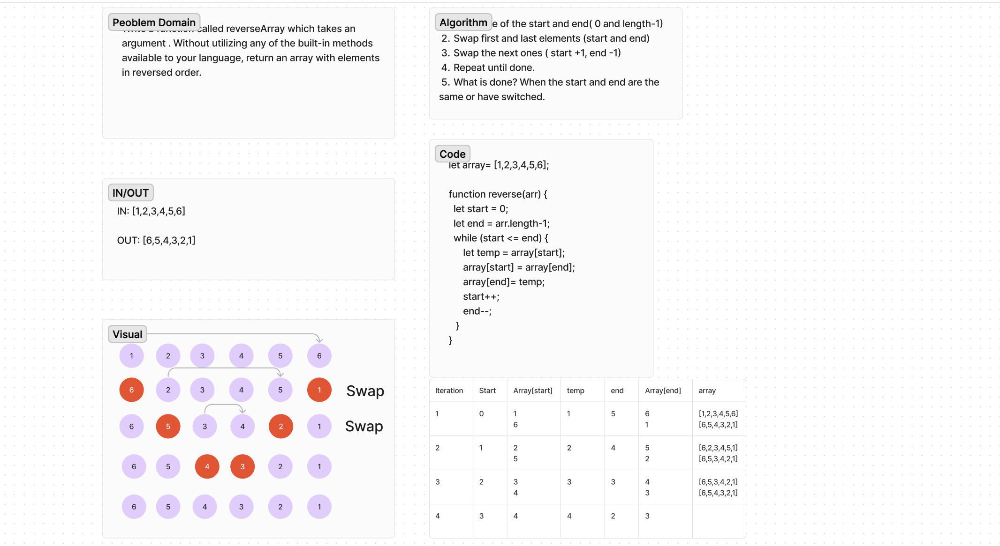

# Challenge Title

Write a function called reverseArray which takes an array as an argument. Without utilizing any of the built-in methods available to your language, return an array with elements in reversed order.

## Whiteboard Process

## Approach & Efficiency
Reversed array by swapping elements from the outside working in.

## Solution
Not required.
